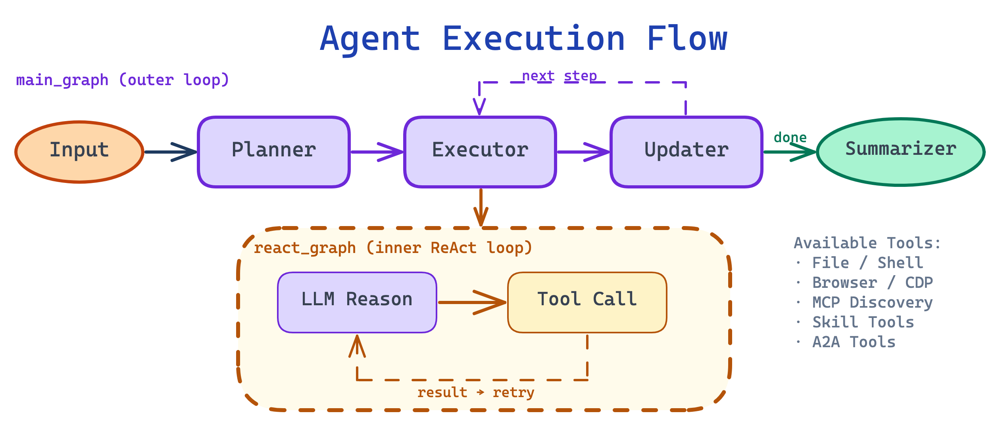
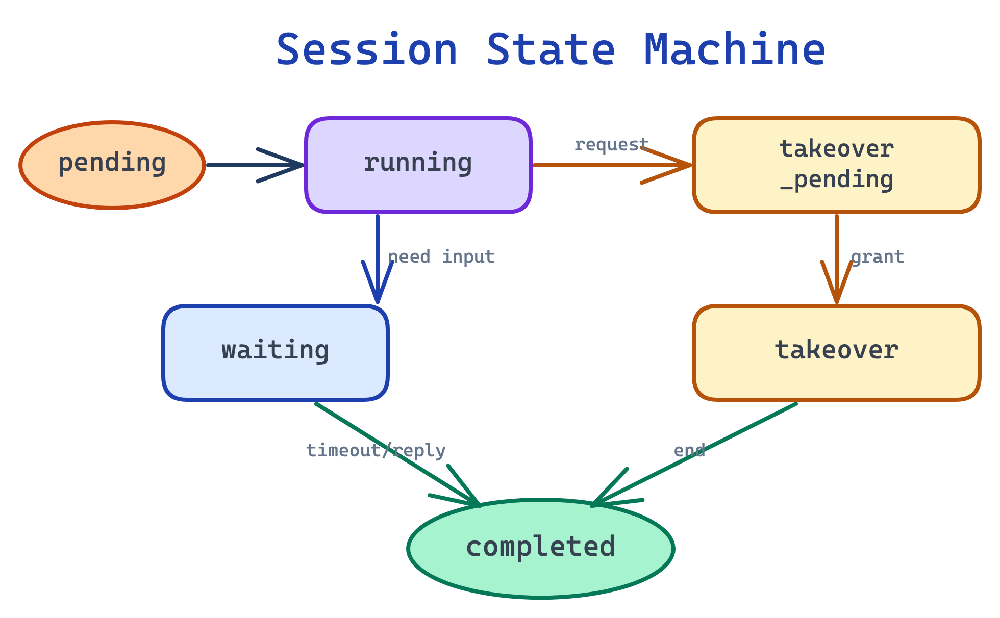

# Actus 项目架构

本文档描述当前代码库的真实分层、运行链路和关键模块，重点对应：

- `api/`
- `ui/`
- `sandbox/`
- `docker-compose.yml`

## 1. 系统组成

Actus 由三个运行时构成：

### 1.1 `api/`

FastAPI 后端，负责：

- 用户认证与管理员能力
- 会话创建、消息流、任务状态
- Planner + ReAct Agent 编排
- 工具调用与 Skill 运行时选择
- 文件上传下载
- 应用配置、MCP/A2A/Skill 管理
- Docker 沙箱生命周期管理

### 1.2 `ui/`

Next.js 16 前端，负责：

- 登录 / 注册
- 会话列表与首页输入
- 会话详情、任务摘要、文件面板
- 工作台终端 / 浏览器 / VNC / 时间线
- 设置页（LLM、MCP、A2A、Skill、用户管理）

### 1.3 `sandbox/`

会话级隔离运行环境，提供：

- Shell 执行与 PTY/WebSocket 交互
- 文件读写、替换、搜索
- Chromium + CDP
- Xvfb + x11vnc + websockify
- Supervisor 超时控制与进程管理

## 2. 后端分层

后端遵循 `Clean Architecture + DDD` 风格，目录层次如下：

```text
api/
├── core/
├── app/
│   ├── domain/
│   ├── application/
│   ├── infrastructure/
│   └── interfaces/
├── scripts/
└── tests/
```

### 2.1 `core/`

职责：

- 环境变量读取
- JWT 与密码安全
- 全局基础配置

当前关键文件：

- `api/core/config.py`

### 2.2 `domain/`

职责：

- 领域模型：会话、消息、计划、事件、文件、Skill、用户
- 抽象接口：仓储、外部依赖、任务系统
- 领域服务：Agent、Flow、Tool、Prompt

关键结构：

- `app/domain/models/`
- `app/domain/repositories/`
- `app/domain/external/`
- `app/domain/services/graphs/` — LangGraph 状态机（main_graph、react_graph、state、event_bridge、compaction、context_assembler、token_estimator）
- `app/domain/services/flows/` — 流程编排（PlannerReActFlow、skill_creation_graph）
- `app/domain/services/tools/` — LangChain 工具（langchain_tools、langchain_mcp、langchain_a2a、skill、langchain_mcp_discovery、langchain_dynamic_skill_tools）
- `app/domain/services/prompts/`
- `app/domain/services/skill_md_parser.py` — SKILL.md 解析
- `app/domain/services/skill_md_exporter.py` — SKILL.md 导出

### 2.3 `application/`

职责：

- 用例编排
- 业务规则收敛
- 组合仓储、外部依赖与领域服务

当前重点服务：

- `AgentService`
- `SessionService`
- `AuthService`
- `FileService`
- `AppConfigService`
- `SkillService`
- `SkillCreatorService`
- `UserToolPreferenceService`
- `MemoryFlushService` — 后台异步记忆刷新，含指数退避和熔断器

### 2.4 `infrastructure/`

职责：

- PostgreSQL / Redis / MinIO 客户端
- SQLAlchemy ORM 模型与仓储实现
- Docker Sandbox、搜索、浏览器、LLM 等外部实现
- 日志初始化

关键目录：

- `app/infrastructure/storage/`
- `app/infrastructure/repositories/`
- `app/infrastructure/external/`
  - `llm/` — LLM 适配器 + 消息清洗器（message_sanitizer）
  - `embedding/` — Embedding 提供者、Redis 缓存、向量索引
  - `file_processors/` — 文件处理器（audio、image、pdf、video、registry）
  - `sandbox/` — Docker 沙箱客户端
  - `file_storage/` — MinIO/S3 文件存储
- `app/infrastructure/checkpointer_pool.py` — LangGraph 检查点连接池
- `app/infrastructure/logging/`

### 2.5 `interfaces/`

职责：

- FastAPI 路由
- Pydantic Schema
- 认证与限流依赖
- 异常处理
- 依赖注入组装

关键目录：

- `app/interfaces/endpoints/`
- `app/interfaces/schemas/`
- `app/interfaces/dependencies/`
- `app/interfaces/errors/`
- `app/interfaces/service_dependencies.py`（主要 DI 入口）
- `app/interfaces/repository_dependencies.py`（已废弃）

## 3. 依赖方向

```text
Interfaces -> Application -> Domain
                 ^
                 |
          Infrastructure

Core 被多层共享使用
```

说明：

- `Domain` 不直接依赖 FastAPI、SQLAlchemy、Redis 等框架实现
- `Infrastructure` 实现 `Domain` 定义的接口
- `Interfaces` 通过 FastAPI `Depends()` 组装具体服务

## 4. Agent 执行链路

### 4.1 入口

会话聊天请求从 `api/app/interfaces/endpoints/session_routes.py` 的：

- `POST /api/sessions/{session_id}/chat`

进入系统，并以 SSE 持续输出事件。

### 4.2 运行时对象

`AgentService` 负责：

- 校验会话和附件权限
- 复用或创建会话沙箱
- 创建 `AgentTaskRunner`
- 启动或恢复任务执行
- 处理停止、接管、续期、补救等控制流

### 4.3 LangGraph 两层图架构



默认流程通过 `PlannerReActFlow` 驱动，内部使用 LangGraph StateGraph：

**外层 main_graph（`domain/services/graphs/main_graph.py`）：**

1. `planner_node` — LLM 生成任务计划（with_structured_output）
2. `executor_node` — 调用 react_graph 执行当前步骤
3. `updater_node` — LLM 评估执行结果，更新计划状态
4. `summarizer_node` — LLM 生成最终总结 + 文件附件

**内层 react_graph（`domain/services/graphs/react_graph.py`）：**

LLM reasoning → tool calls → tool results → 循环直到完成或需要用户输入

**事件桥接（`domain/services/graphs/event_bridge.py`）：**

将 LangGraph `astream_events` 转换为 Actus 的 SSE 事件（MessageEvent、ToolEvent、PlanEvent 等）

**Skill 创建子图（`domain/services/flows/skill_creation_graph.py`）：**

独立状态机：blueprint_node → generate_node → install_node，每步带用户确认门控

### 4.4 事件模型

前端接收的主要 SSE 事件类型：

- `message`
- `title`
- `step`
- `plan`
- `tool`
- `wait`
- `control`
- `done`
- `error`

## 5. 工具体系

工具分为两类：

### 5.1 LangChain 工厂工具（`langchain_tools.py`）

通过工厂函数创建，返回 `list[StructuredTool]`：

- `_make_file_tools(sandbox)` → file_read, file_write, file_str_replace, file_find_in_content, file_find_by_name, file_list
- `_make_shell_tools(sandbox)` → shell_execute, shell_read_output, shell_wait_process, shell_write_input, shell_kill_process
- `_make_browser_tools(browser)` → browser_view, browser_navigate, browser_click, browser_input, etc.

### 5.2 领域工具（继承 `BaseTool`）

- `skill.py` — SkillTool，native/mcp/a2a skill 运行时调度
- `create_skill.py` — CreateSkillTool，Skill 生成与安装
- `brainstorm_skill.py` — BrainstormSkillTool，Skill 蓝图分析
- `langchain_mcp.py` — MCP 工具适配为 LangChain StructuredTool
- `langchain_mcp_discovery.py` — 渐进式 MCP 工具发现（list_mcp_tools / get_mcp_tool）
- `langchain_a2a.py` — A2A 工具适配为 LangChain StructuredTool
- `langchain_skill_tools.py` — Skill 工具适配为 LangChain StructuredTool
- `langchain_dynamic_skill_tools.py` — 基于 Embedding 向量相似度动态选择 Skill 工具

### 5.3 LLM 适配器（`infrastructure/external/llm/`）

- `ActusChatModel` — 包装 OpenAI Chat Completions API 为 LangChain BaseChatModel
- `ActusResponsesModel` — 包装 OpenAI Responses API
- `ActusFallbackChatModel` — Chat Completions 优先，失败回退 Responses

所有适配器调用前经过 `message_sanitizer.py` 清洗多模态内容（图片 >5MB、无效 MIME、PDF >50MB）。

## 6. Skill 生态

当前 Skill 体系为 v2，特点如下：

- 权威存储位于文件系统，而非数据库
- 默认根目录：`/app/data/skills`
- 支持 GitHub 仓库、本地目录和 SKILL.md 格式安装
- 基于 Embedding 向量相似度进行语义 Skill 选择
- 用户层开关保存在 `user_tool_preferences`
- 旧版 `/api/app-config/skills/*` 接口保留为 `410` 迁移提示

关键组件：

- `SkillService`
- `SkillSourceLoader`
- `SkillIndexService`
- `SkillSelector`
- `SkillTool`
- `FileSkillRepository`

## 7. 会话与接管



当前会话状态枚举位于 `api/app/domain/models/session.py`：

- `pending`
- `running`
- `takeover_pending`
- `takeover`
- `waiting`
- `completed`

接管能力包括：

- 主动发起 `shell` / `browser` 接管
- 接管租约续期
- 结束接管后继续执行或直接完成
- 在窗口期内对已完成会话执行补救重开

相关 API 与 WebSocket 位于：

- `session_routes.py`

## 8. 前端结构

前端使用 App Router，主要页面如下：

- `/`：首页输入与会话入口
- `/login`
- `/register`
- `/sessions/[id]`：会话详情与工作台

关键组件：

- `LeftPanel`：会话列表与主题切换
- `ChatInput`：输入区
- `SessionTaskDock`：任务摘要与文件面板
- `WorkbenchPanel`：终端 / 浏览器 / VNC / 时间线
- `components/manus-settings.tsx`：设置总入口

状态管理：

- `ui/src/lib/store/` 下使用 Zustand

## 9. 沙箱结构

沙箱镜像由 `sandbox/Dockerfile` 构建，容器内通过 `supervisord.conf` 启动：

- FastAPI 应用（8080）
- Chromium（经 `socat` 转发到 9222）
- Xvfb
- x11vnc（5900）
- websockify（5901）

沙箱 API 路由分为：

- `/api/file/*`
- `/api/shell/*`
- `/api/supervisor/*`

API 服务不会常驻调用独立的 Compose `sandbox` 容器，而是基于镜像动态创建临时会话容器。

## 10. 配置来源

### 10.1 Compose 环境变量

由根目录 `.env` 驱动，主要用于：

- 数据库密码
- JWT 密钥
- MinIO/S3 接入
- UI 对外地址
- 沙箱镜像与网络

### 10.2 后端运行时配置

由 `AppConfig` 管理，包括：

- LLM 配置
- Agent 配置
- MCP 配置
- A2A 配置
- Skill 风险策略

容器模式下默认文件路径：

```text
/app/data/config.yaml
```

本地开发默认文件路径：

```text
api/config.yaml
```

## 11. 测试布局

后端测试位于：

- `api/tests/app/`
- `api/tests/domain/`
- `api/tests/integration/`

前端测试与源码并列，主要位于：

- `ui/src/**/*.test.ts`
- `ui/src/**/*.test.tsx`

## 12. 当前设计要点

- **LangGraph 状态机**：Agent 编排从自定义 BaseAgent 迁移到 LangGraph StateGraph，获得原生的状态持久化、中断恢复、事件流能力
- **LangChain 统一接口**：LLM 调用通过 BaseChatModel 抽象，工具通过 `@tool` 装饰器注册，支持 `with_structured_output` 和 `bind_tools`
- **上下文溢出治理**：TokenEstimator（混合 token 估算）+ ContextAssembler（同步三阶段裁剪）+ GradualCompactor（异步两级压缩：85% LLM 摘要 / 95% 硬截断）
- **多模态文件理解**：FileProcessorRegistry 按 MIME 路由到 audio/image/pdf/video 处理器，支持双引擎转录和双路径 PDF 解析
- **Embedding Skill 选择**：基于 OpenAI Embedding + numpy 向量索引 + Redis 缓存的语义 Skill 匹配
- **渐进式 MCP 发现**：先列出 metadata，按需加载完整 schema 并激活
- **Checkpointer 连接池**：psycopg AsyncConnectionPool，应用生命周期管理
- **三阶段 Skill 生成**：manifest → 逐个脚本 → SKILL.md，每阶段独立重试，失败修复支持定向重生成
- 前端与后端都采用流式交互，减少长任务等待感
- Skill、MCP、A2A 都纳入同一套 Agent 工具调度体系
- 接管不是单点功能，而是贯穿状态机、SSE 事件、WebSocket 与前端工作台的完整链路
- Shell/Skill 执行产生的输出文件自动同步到会话文件列表
- Compose 部署与本地开发的配置来源不同，文档和运维需要明确区分
